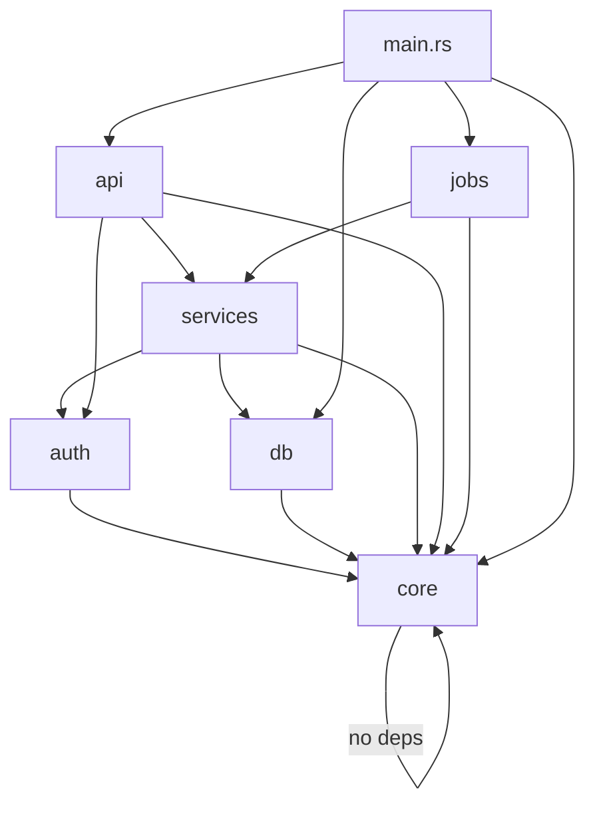

# 51 - Module Mapping

**Output**: `.migration-plan/mappings/module-mapping.md`

## Purpose

Map every source module, package, or directory to its Rust crate or module equivalent. This document defines the target Cargo workspace layout, establishes migration order based on dependency analysis, and assigns complexity ratings to each module. It is the structural backbone of the migration -- every other mapping document (types, dependencies, errors) operates within the module boundaries defined here.

For Rust migration, this document answers:
- How many crates will the workspace contain?
- Which source modules merge, split, or map 1:1?
- What is the dependency order for migration (which modules must be migrated first)?
- How complex is each module to migrate?

## Template

```markdown
# Module Mapping

Source: {project_name}
Generated: {date}

## Workspace Layout

```text
{project_name}/
├── Cargo.toml                    # Workspace root
├── crates/
│   ├── {crate_name}/             # {responsibility}
│   │   ├── Cargo.toml
│   │   └── src/
│   │       ├── lib.rs
│   │       ├── {module}.rs
│   │       └── {module}/
│   │           ├── mod.rs
│   │           └── {submodule}.rs
│   ├── {crate_name}/             # {responsibility}
│   │   ├── Cargo.toml
│   │   └── src/
│   │       └── lib.rs
│   └── ...
└── src/
    └── main.rs                   # Binary entry point (if applicable)
```

## Workspace Cargo.toml

```toml
[workspace]
members = [
    "crates/{crate_name}",
    "crates/{crate_name}",
    ...
]
resolver = "2"

[workspace.package]
version = "{version}"
edition = "2021"
authors = ["{authors}"]
license = "{license}"

[workspace.dependencies]
# Shared dependencies pinned at workspace level
serde = { version = "1", features = ["derive"] }
serde_json = "1"
tokio = { version = "1", features = ["full"] }
thiserror = "2"
anyhow = "1"
tracing = "0.1"
uuid = { version = "1", features = ["v4", "serde"] }
chrono = { version = "0.4", features = ["serde"] }
# ... project-specific shared deps
```

## Module Mapping Table

| # | Source Path | Source Files | Source LOC | Responsibility | Rust Target | Migration Complexity | Migration Phase | Est. Rounds |
|---|------------|-------------|-----------|----------------|-------------|---------------------|----------------|-------------|
| 1 | {src/models/} | {N} | {N} | {description} | crates/{crate}/src/{module}.rs | {Low/Medium/High/Very High} | {1-5} | {N} |
| 2 | {src/services/} | {N} | {N} | {description} | crates/{crate}/src/{module}.rs | {Low/Medium/High/Very High} | {1-5} | {N} |
| 3 | {src/api/} | {N} | {N} | {description} | crates/{crate}/src/{module}/ | {Low/Medium/High/Very High} | {1-5} | {N} |
| ... | | | | | | | | |
| **Total** | | **{N}** | **{N}** | | | | | **{N}** |

### Complexity Rating Criteria

| Rating | Criteria |
|--------|----------|
| Low | Simple data types, pure functions, minimal dependencies, direct Rust equivalent exists |
| Medium | Some async code, moderate dependencies, standard patterns (CRUD, validation) |
| High | Complex async flows, heavy framework coupling, custom abstractions, ORM usage |
| Very High | Unsafe operations needed, no crate equivalent, complex concurrency, FFI required |

## Detailed Module Mapping

### Module M-1: {source_path} -> {rust_target}

**Source**:
- Path: `{source_directory}/`
- Files: {N}
- Lines of Code: {N}
- Language: {TypeScript / Python / Go}

**Rust Target**:
- Crate: `{crate_name}`
- Module: `{module_path}` (e.g., `crates/core/src/models/`)
- Type: {Library crate / Binary crate / Module within crate}

**Responsibility**: {What this module does}

**Public API Surface**:

| Export | Type | Source Location | Rust Equivalent |
|--------|------|-----------------|-----------------|
| {ExportedName} | {class / function / type / constant} | [{file}:{line}](../src/{file}#L{line}) | {struct / fn / trait / const} |
| {ExportedName} | {class / function / type / constant} | [{file}:{line}](../src/{file}#L{line}) | {struct / fn / trait / const} |
| ... | | | |

**Internal Dependencies** (modules this module imports from):

| Dependency Module | What It Uses | Rust Import |
|-------------------|-------------|-------------|
| {module_name} | {types / functions used} | `use {crate}::{module}::{item}` |
| {module_name} | {types / functions used} | `use {crate}::{module}::{item}` |

**External Dependencies** (crates this module needs):

| Source Package | Rust Crate | Usage |
|---------------|------------|-------|
| {package} | `{crate}` | {what it's used for in this module} |
| {package} | `{crate}` | {what it's used for in this module} |

**Migration Notes**:
- {Any special considerations, pattern changes, or challenges}
- {E.g., "ORM queries must be rewritten as raw SQL with sqlx"}
- {E.g., "Class inheritance must be refactored to composition + traits"}

**Complexity Justification**: {Why this module is rated Low/Medium/High/Very High}

---

{Repeat for each module M-2, M-3, ... M-N}

---

## Dependency Graph

```mermaid
graph TD
    A[{crate_name}] --> B[{crate_name}]
    A --> C[{crate_name}]
    B --> D[{crate_name}]
    C --> D
    D --> E[{crate_name}]
```

### ASCII Dependency Graph (fallback)

```text
Level 0 (no internal deps):
  [{crate_name}] [{crate_name}]

Level 1 (depends on Level 0):
  [{crate_name}] --> [{crate_name}]

Level 2 (depends on Level 0-1):
  [{crate_name}] --> [{crate_name}], [{crate_name}]

Level 3 (depends on Level 0-2):
  [{crate_name}] --> [{crate_name}], [{crate_name}]

Level 4 (binary, depends on all):
  [{binary_name}] --> [{crate_name}], [{crate_name}], ...
```

## Migration Order

| Phase | Modules | Rationale |
|-------|---------|-----------|
| 1 - Foundation | {module_list} | No internal dependencies; leaf nodes of the dependency graph |
| 2 - Core | {module_list} | Depend only on Phase 1 modules |
| 3 - Business Logic | {module_list} | Depend on Phase 1-2 modules |
| 4 - Interface | {module_list} | API/CLI layer, depends on everything below |
| 5 - Integration | {module_list} | Entry points, binary crates, glue code |

## Modules Merged or Split

### Merged Modules

| Source Modules | Rust Target | Reason |
|---------------|-------------|--------|
| {src/a/, src/b/} | {crates/combined/} | {e.g., "Both are small utility modules, < 200 LOC combined"} |

### Split Modules

| Source Module | Rust Targets | Reason |
|--------------|-------------|--------|
| {src/monolith/} | {crates/a/, crates/b/} | {e.g., "Contains both domain types and HTTP handlers; split for separation of concerns"} |

### 1:1 Modules (No Change)

| Source Module | Rust Target |
|--------------|-------------|
| {src/auth/} | {crates/auth/} |
| {src/cache/} | {crates/cache/} |

## Files Not Mapped

| File | Reason |
|------|--------|
| {src/generated/prisma.ts} | Generated code, replaced by sqlx queries |
| {src/__tests__/} | Tests rewritten natively in Rust |
| {src/scripts/seed.ts} | One-off script, migrated separately if needed |
| {webpack.config.js} | Build config, replaced by Cargo.toml |
```

## Instructions

When producing this document:

1. **Read `analysis/source-inventory.md` and `analysis/architecture.md`** to understand the full module structure and dependency relationships.
2. **Every source directory containing business logic must appear** in the Module Mapping Table. Do not skip small utility modules.
3. **Determine workspace layout first**: Decide whether to use a single crate (< 20 source files), a flat workspace (20-100 files), or a nested workspace (> 100 files).
4. **Calculate migration order by analyzing dependencies**: Modules with zero internal dependencies go first (Phase 1). Modules depending only on Phase 1 modules go in Phase 2. Continue until all modules are assigned.
5. **Complexity ratings must be justified** in each module's detail section. Do not assign "High" without explaining why.
6. **Public API surface must list every export**, not just "exports 15 functions". Name each exported item.
7. **The dependency graph must be acyclic**. If circular dependencies exist in the source, document how they will be broken in the Rust version.
8. **Merged/Split decisions must be explicit**. If two source modules become one Rust crate, or one source module becomes two Rust crates, explain why.
9. **Files Not Mapped** must list every source file that does not have a Rust equivalent (generated code, config files, test fixtures).
10. Write in the same language the user used to invoke the skill.

## Example

```markdown
# Module Mapping

Source: taskflow-api
Generated: 2026-03-05

## Workspace Layout

```text
taskflow-api/
├── Cargo.toml                    # Workspace root
├── crates/
│   ├── core/                     # Domain types, errors, config
│   │   ├── Cargo.toml
│   │   └── src/
│   │       ├── lib.rs
│   │       ├── types.rs          # User, Task, Team, Project structs
│   │       ├── error.rs          # AppError, AuthError, DbError
│   │       └── config.rs         # AppConfig from env
│   ├── db/                       # Database access layer
│   │   ├── Cargo.toml
│   │   └── src/
│   │       ├── lib.rs
│   │       ├── pool.rs           # Connection pool management
│   │       ├── users.rs          # User queries
│   │       ├── tasks.rs          # Task queries
│   │       ├── teams.rs          # Team queries
│   │       └── projects.rs       # Project queries
│   ├── auth/                     # Authentication and authorization
│   │   ├── Cargo.toml
│   │   └── src/
│   │       ├── lib.rs
│   │       ├── jwt.rs            # Token generation and validation
│   │       ├── password.rs       # Argon2 hashing
│   │       └── session.rs        # Session management
│   ├── services/                 # Business logic layer
│   │   ├── Cargo.toml
│   │   └── src/
│   │       ├── lib.rs
│   │       ├── task_service.rs
│   │       ├── team_service.rs
│   │       └── project_service.rs
│   ├── api/                      # Axum HTTP handlers
│   │   ├── Cargo.toml
│   │   └── src/
│   │       ├── lib.rs
│   │       ├── routes/
│   │       │   ├── mod.rs
│   │       │   ├── tasks.rs
│   │       │   ├── teams.rs
│   │       │   ├── users.rs
│   │       │   └── projects.rs
│   │       ├── middleware/
│   │       │   ├── mod.rs
│   │       │   ├── auth.rs
│   │       │   └── rate_limit.rs
│   │       └── extractors.rs
│   └── jobs/                     # Background job processors
│       ├── Cargo.toml
│       └── src/
│           ├── lib.rs
│           ├── email_job.rs
│           └── report_job.rs
└── src/
    └── main.rs                   # Binary entry point
```

## Module Mapping Table

| # | Source Path | Source Files | Source LOC | Responsibility | Rust Target | Migration Complexity | Migration Phase | Est. Rounds |
|---|------------|-------------|-----------|----------------|-------------|---------------------|----------------|-------------|
| 1 | src/models/ | 8 | 1,200 | Prisma types, validation schemas | crates/core/src/types.rs | Medium | 1 | 2 |
| 2 | src/lib/config.ts | 1 | 85 | Environment configuration | crates/core/src/config.rs | Low | 1 | 0.5 |
| 3 | src/lib/errors.ts | 1 | 140 | Custom error classes | crates/core/src/error.rs | Low | 1 | 1 |
| 4 | src/lib/auth/ | 4 | 560 | JWT + password hashing | crates/auth/ | Medium | 2 | 2 |
| 5 | src/lib/cache/ | 3 | 340 | Redis cache wrapper | crates/db/src/cache.rs | Low | 2 | 1 |
| 6 | src/services/ | 10 | 2,680 | Business logic | crates/services/ | High | 3 | 4 |
| 7 | src/api/routes/ | 12 | 1,850 | Express route handlers | crates/api/src/routes/ | High | 4 | 3 |
| 8 | src/api/middleware/ | 5 | 420 | Auth, validation, error middleware | crates/api/src/middleware/ | Medium | 4 | 1.5 |
| 9 | src/jobs/ | 6 | 890 | BullMQ job processors | crates/jobs/ | High | 4 | 2 |
| 10 | src/lib/email/ | 3 | 280 | Email templates and sending | crates/jobs/src/email.rs | Low | 4 | 1 |
| **Total** | | **87** | **12,450** | | | | | **18** |

## Detailed Module Mapping

### Module M-1: src/models/ -> crates/core/src/types.rs

**Source**:
- Path: `src/models/`
- Files: 8
- Lines of Code: 1,200
- Language: TypeScript

**Rust Target**:
- Crate: `core`
- Module: `crates/core/src/types.rs`
- Type: Library crate (module within)

**Responsibility**: Define all domain entities (User, Task, Team, Project) with their associated types, enums, and Zod validation schemas.

**Public API Surface**:

| Export | Type | Source Location | Rust Equivalent |
|--------|------|-----------------|-----------------|
| User | interface | [models/user.ts:5](../src/models/user.ts#L5) | struct User |
| CreateUserInput | interface | [models/user.ts:15](../src/models/user.ts#L15) | struct CreateUserInput |
| Task | interface | [models/task.ts:8](../src/models/task.ts#L8) | struct Task |
| TaskStatus | enum | [models/task.ts:1](../src/models/task.ts#L1) | enum TaskStatus |
| CreateTaskInput | interface | [models/task.ts:22](../src/models/task.ts#L22) | struct CreateTaskInput |
| Team | interface | [models/team.ts:5](../src/models/team.ts#L5) | struct Team |
| Project | interface | [models/project.ts:5](../src/models/project.ts#L5) | struct Project |
| Priority | enum | [models/common.ts:1](../src/models/common.ts#L1) | enum Priority |
| PaginationParams | interface | [models/common.ts:10](../src/models/common.ts#L10) | struct PaginationParams |
| PaginatedResponse<T> | generic type | [models/common.ts:16](../src/models/common.ts#L16) | struct PaginatedResponse<T> |

**Internal Dependencies**: None (leaf module)

**External Dependencies**:

| Source Package | Rust Crate | Usage |
|---------------|------------|-------|
| zod | validator | Input validation derive macros |
| @prisma/client | sqlx | Type derives (FromRow) |

**Migration Notes**:
- Prisma-generated types must be manually defined as Rust structs with serde and sqlx derives
- Zod schemas become `validator` derive macros on input structs
- Optional fields (string | null) become `Option<String>`
- Date fields (Date) become `chrono::DateTime<Utc>`

**Complexity Justification**: Medium -- types are straightforward but Prisma-generated types require manual reconstruction, and Zod schemas need conversion to validator macros.

---

## Dependency Graph



### ASCII Dependency Graph (fallback)

```text
Level 0 (no internal deps):
  [core]

Level 1 (depends on Level 0):
  [auth] --> [core]
  [db] --> [core]

Level 2 (depends on Level 0-1):
  [services] --> [core], [db], [auth]

Level 3 (depends on Level 0-2):
  [api] --> [core], [services], [auth]
  [jobs] --> [core], [services]

Level 4 (binary, depends on all):
  [main.rs] --> [api], [jobs], [db], [core]
```

## Migration Order

| Phase | Modules | Rationale |
|-------|---------|-----------|
| 1 - Foundation | core (types, errors, config) | No internal dependencies; every other module depends on it |
| 2 - Data Layer | auth, db | Depend only on core; provide data access for business logic |
| 3 - Business Logic | services | Depends on core, db, auth; contains the domain logic |
| 4 - Interface | api, jobs | Depend on services; the outermost layer |
| 5 - Integration | main.rs | Wires everything together |
```

## Quality Criteria

- [ ] Every source directory with business logic has a row in the Module Mapping Table
- [ ] Workspace Cargo.toml is complete with all member crates listed
- [ ] Workspace layout tree shows every crate, module, and file
- [ ] Each module has a detailed section with public API surface listing every export
- [ ] Internal dependencies are listed with specific items used (not just "uses auth module")
- [ ] External dependencies are listed per module (not just globally)
- [ ] Complexity rating is assigned with written justification for each module
- [ ] Dependency graph is acyclic -- circular dependencies are identified and resolved
- [ ] Migration order follows dependency graph (leaf modules first)
- [ ] Merged/split decisions are documented with rationale
- [ ] Files Not Mapped section accounts for every source file without a Rust equivalent
- [ ] Estimated rounds per module sum to the total shown in the migration plan
- [ ] Mermaid and ASCII dependency graphs are both provided
